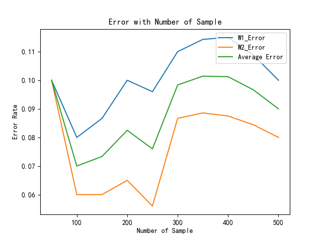

# Pattern-Recognition_HW1
### 产生d维高斯分布样本点
```py
def Gaussion (mean,cov,M):
    ''' 生成高斯样本'''
    sample = np.random.multivariate_normal(mean=mean, cov=cov, size=M) 
    return sample
```
&emsp;&emsp;`np.random.multivariate_normal`函数可以返回均值为`mean`，方差为`cov`，共`M`个样本点，其中维度D需要通过均值和方差的维度来体现。
### 贝叶斯边界
**·函数说明**
```py
def Bi_Bayes(mean1 = [1,0],
             mean2=[-1,0],
             cov1=np.matrix([[1,0],[0,1]]),
             cov2=np.matrix([[1,0],[0,1]]),
             N=50,
             save_path ='./picture/',
             issave = False):
    '''
    Parameter:
    -------------
    mean1,mean2：两类的均值
    cov1,cov2：两类分别的协方差
    N：各多少个样本值
    isshow：是否展示图片，默认True
    issave：是否保存图片，默认False
    '''
```
&emsp;&emsp;函数的定义，解释给出需要输入的参数，默认就是题目要求的参数。理论基础为**高维高斯分布概率密度公式**
$$ P(\bm{x}|\omega_i) = \frac{1}{(2\pi)^{d/2}|\Sigma_i|^{1/2}}\exp\Big[-\frac{1}{2}(\bm{x}-\mu_i)\Sigma^{-1}(\bm{x}-\mu_i)\Big] $$

**·参数设置**
```py    
    np.random.seed(0)

    x1 = np.random.multivariate_normal(mean=mean1, cov=cov1, size=N)  # 随机高斯抽样
    x2 = np.random.multivariate_normal(mean=mean2, cov=cov2, size=N)

    # 把均值矩阵处理
    mean1 = np.matrix(mean1)
    mean2 = np.matrix(mean2)
```
**·计算判别函数**
```py
    X = np.vstack((x1, x2))  # X拼接

    # 由公式计算得到
    # g1x g2x 实现课程中的判别函数
    W1 = mean1.dot(cov1.I).dot(X.T)
    W10 = mean1.dot(cov1.I).dot(mean1.T)
    g1x = W1 - 0.5*W10 + np.log(0.5)

    W2 = mean2.dot(cov2.I).dot(X.T)
    W20 = mean2.dot(cov2.I).dot(mean2.T)
    g2x = W2 - 0.5*W20 + np.log(0.5)

    # 计算
    # 平面方程 W[0,0]X1 + W[0,1]X2 = 0
    W = mean1.dot(cov1.I) - mean2.dot(cov2.I)
    C = 0.5 * (-W10-(-W20))
    # print(C)
    x_min = min(np.min(x2[:, 0]),np.min(x1[:, 0]))
    x_max = max(np.max(x2[:, 0]),np.max(x1[:, 0]))
    y_min = min(np.min(x2[:, 1]),np.min(x1[:, 1]))
    y_max = max(np.max(x2[:, 1]),np.max(x1[:, 1]))

    Xx1 = np.linspace(x_min-1,x_max+1)
    Xx2 = np.linspace(y_min-1,y_max+1)
    Xx1, Xx2 = np.meshgrid(Xx1, Xx2)

    z = W[0, 0]*Xx1 + W[0, 1]*Xx2 + C[0, 0]
    print('决策面方程为：{}x1 + {}x2 + {} = 0'.format(W[0, 0], W[0, 1],C[0, 0]))
```
&emsp;&emsp;根据Case1中的判别函数公式，计算$\omega_i$，公式如下：
$$\begin{align}
   g_i(x) &= \text{w}_i x + \omega_{i0} \\
\text{w}_i &= (\sigma^2)^{-1}\mu_i \tag*{}\\
\omega_{i0} &= \frac{-1}{2} (\sigma^2)^{-1}\mu^t_i\mu_i + \ln{P(\omega_i)}\tag*{}\\
\end{align}$$
&emsp;&emsp;在二维二分类高斯判别情况下，决策面可以直接写出决策面方程，如下：
$$\begin{align}
\omega_1x_1 +\omega_1x_2+\omega_{20}-\omega_{10} = 0 
\end{align}$$

**·错误率计算**
```py   
    ''' 计算错误率'''
    w1_error = 0 # 第一类分错的个数
    w2_error = 0 # 第二类分错的个数
    
    for i in range(N):
        if W[0, 0]*x1[i,0] + W[0, 1]*x1[i,1] + C[0, 0]<0:
            w1_error+=1
        if W[0, 0]*x2[i,0] + W[0, 1]*x2[i,1] + C[0, 0]>0:
            w2_error+=1
        else: pass
    print('w1 error',w1_error)
    print('w2 error',w2_error)
```
**·画图**
```py
    ''' 绘图'''            

    # fig = plt.figure()
    # ax = fig.add_axes([0,0,1,1])
    plt.rcParams['font.sans-serif'] = ['SimHei']  # 用来正常显示中文标签
    plt.rcParams['axes.unicode_minus'] = False  # 用来正常显示负号
    plt.title('Bayesian_Decision')
    plt.xlabel('X分量1')
    plt.ylabel('X分量2')
    # ax.set_xlim(min(x1[:, 0]+x2[:, 0]), max(x1[:, 1]+x2[:, 1]))
    # ax.set_ylim()
    plt.contour(Xx1, Xx2, z, 0)
    plt.scatter(x1[:, 0], x1[:, 1])
    plt.scatter(x2[:, 0], x2[:, 1])
    plt.legend(('Sample1','Sample2'),loc='upper right') 
    if issave:
        plt.savefig(save_path+'x1均值{}_{}_x2均值{}_{}_各{}.png'.format(mean1[0,0],mean1[0,1],mean2[0,0],mean2[0,1],N),dpi=1000)
    plt.show() 
    return float(w1_error/N),float(w2_error/N)
```
### Main
```py
if __name__=='__main__':
    mean1 = [1,0]
    mean2 = [-1,0]
    cov1=np.matrix([[1,0],[0,1]])
    cov2=np.matrix([[1,0],[0,1]])
    save_path = './picture/'
    
    X= Gaussion(mean=[1,0],cov=cov1,M=50)
    
    A = []
    B = []
    
    for i in range(10):    
        e1,e2 = Bi_Bayes(mean1,mean2,cov1,cov2,50*(i+1),save_path=save_path,issave=False)
        A.append(e1)
        B.append(e2)
    C = [(A[i]+B[i])/2 for i in range(10)]
    print(A)
    print(B)
    
    x = np.linspace(50,500,10)
    plt.plot(x,A)
    plt.plot(x,B)
    plt.plot(x,C)
    plt.title('Error with Number of Sample')
    plt.xlabel('Number of Sample')
    plt.ylabel('Error Rate')
    plt.legend(('W1_Error','W2_Error','Average Error'),loc='upper right')
    plt.savefig(save_path+'Error_Rate.png')
    plt.show()
```
### 结果
#### 1. x1均值1_0_x2均值-1_0_各50

`W1_Error Rate = 0.16`
`W2_Error Rate = 0.14`
#### 2. x1均值1_0_x2均值-1_0_各100

`W1_Error Rate = 0.18`
`W2_Error Rate = 0.1`
#### 3. x1均值1_0_x2均值-1_0_各150

`W1_Error Rate = 0.173`
`W2_Error Rate = 0.113`
#### 4. x1均值1_0_x2均值-1_0_各200

`W1_Error Rate = 0.175`
`W2_Error Rate = 0.125`
#### 5. x1均值1_0_x2均值-1_0_各250

`W1_Error Rate = 0.172`
`W2_Error Rate = 0.124`
#### 6. x1均值1_0_x2均值-1_0_各300

`W1_Error Rate = 0.18`
`W2_Error Rate = 0.15`
#### 7. x1均值1_0_x2均值-1_0_各350

`W1_Error Rate = 0.17429`
`W2_Error Rate = 0.1486`
#### 8. x1均值1_0_x2均值-1_0_各400

`W1_Error Rate = 0.1675`
`W2_Error Rate = 0.145`
#### 9. x1均值1_0_x2均值-1_0_各450

`W1_Error Rate = 0.162`
`W2_Error Rate = 0.142`
#### 10. x1均值1_0_x2均值-1_0_各500

`W1_Error Rate = 0.156`
`W2_Error Rate = 0.144`

### Error


### 方差不变的情况下，均值改变
**贝叶斯决策（第一类均值为(2,1)，第二类均值为(-1,0)，各500）**

决策面方程为：
$$3.0x1 + 1.0x2 -2.0 = 0$$

**误差（第一类均值为(2,1)，第二类均值为(-1,0)）**


### 均值不变的情况下，方差增大
**贝叶斯决策（第一类均值为(2,1)，第二类均值为(-1,0)，各500）**

决策面方程为：
$$2.0x1 + 0.5x2 -0.75 = 0$$

**误差（第一类均值为(2,1)，第二类均值为(-1,0)）**


#### 结论
&emsp;&emsp;二者均值差异增大，会更好分离，但是方差增大，错误率也会升高。